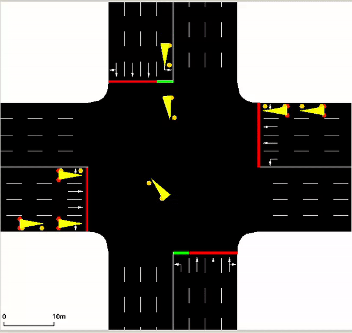
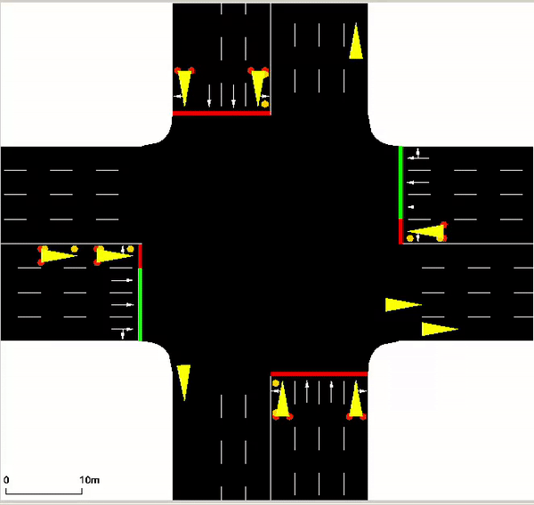

# Deep Reinforcement Learning for Traffic Light Control

## To install required libraries
`pip install -r requirements.txt`

## To generate all the plots and simulations
Run the following command: `python3 main.py`.  

All the plots for the individual algorithms and the respective trained models will be saved in the models folder inside the respective model_(number) folders. For example, if you run the code for the first time after cloning, the new models generated will be model_68 and model_69 for PPO and DQN respectively. The training plots for the individual algorithms and the final trained models will be stored in these two folders. Both these folders will also have a subfolder named test which will store all the plots for the test simulation. Finally, the folder for PPO, i.e., model_68 will also have a compare folder containing training and testing plots comparing the performance of PPO and DQN together in the same figure. 

## Usage
`training_settings.ini`, `training_settings_ppo.ini`, `testing_settings.ini`, `testing_settings_ppo.ini` contain the hyperparameters for training and testing of DQN and PPO algorithms respectively. 

You may need to change the model_to_test parameter in both the testing settings files to generate the final SUMO simulations, according to the model number generated during training.

# Final Simulations:

DQN Simulation            |  PPO Simulation
:-------------------------:|:-------------------------:
 |  

# References
This code is an extension of the code given [here](https://github.com/AndreaVidali/Deep-QLearning-Agent-for-Traffic-Signal-Control). 
Also, this project replicates and builds on the work presented in **Vidali, Andrea et al. “A Deep Reinforcement Learning Approach to Adaptive Traffic Lights Management.” Workshop From Objects to Agents (2019)**.
